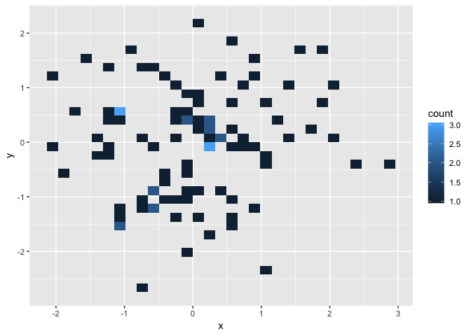

<!-- README.md is generated from README.Rmd. Please edit that file -->

# test

<!-- badges: start -->

<!-- badges: end -->

The goal of test is to … Test the R package I’m trying to build.

## Installation

You can install the released version of test from
[CRAN](https://CRAN.R-project.org) with:

``` r
install.packages("test")
```

## Example

This is a basic example which shows you how to solve a common problem:

``` r
library(test)
suppressMessages(library(tidyverse))
## basic example code
normalized_mtx = test::MyScaleFunction(df = df) %>% as.data.frame()
#> Loading required package: magrittr
#> 
#> Attaching package: 'magrittr'
#> The following object is masked from 'package:purrr':
#> 
#>     set_names
#> The following object is masked from 'package:tidyr':
#> 
#>     extract
ggplot(normalized_mtx, aes(x = x, y = y)) + geom_bin2d()
```



What is special about using `README.Rmd` instead of just `README.md`?
You can include R chunks like so:

You’ll still need to render `README.Rmd` regularly, to keep `README.md`
up-to-date.

You can also embed plots, for example:

In that case, don’t forget to commit and push the resulting figure
files, so they display on GitHub\!
